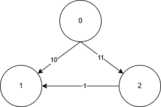

+++
date = '2025-06-17T15:52:42+08:00'
draft = false
title = 'Dijkstra算法'
tags = ["单源最短路", "图论"]
categories = ["算法", "图论"]
+++

# Dijkstra算法
## 📌 简介

Dijkstra 算法是一种**单源最短路径算法**，用于计算从一个起点到图中其他所有顶点的**最短路径**。
适用于**边权非负**的图。

---

## 🧠 算法思想

创建一个集合S，从start开始每次都将当前计算出的**距离集合S所有节点里路径最短的节点**加入到集合S中，直到遍历完所有的点。Dijkstra最重要的一个思想就是第一次遍历到某个节点，将这个节点加入到S中，那么这个节点的最短路径就计算好了，后面一般不会再修改它(有些时候如果求的不是最短路径可能会修改)。

这是因为每次会选择距离集合S中所有节点里路径最短的那个节点加入到S中，Dijkstra需要图保证没有负边，因此加入到集合S的节点的路径只会越来越大。那么对于同一个节点来说，一旦它加入到S中，后面再次遇到这个节点时路径肯定比第一次加入S时大。



举例上面这幅图，假设从0开始加入集合S，那么下一个加入S的是1，因为10比11小，否则加入的是2。此时0到1的最短路径是10，它还有一条路径是12，可想而知那条路径不可能比10小，即使这副图再加入第三条通往1的路径，也不可能比10小。

---

## ✍️ 示例代码

### 堆优化Dijkstra
dist表示集合S，首先将dist全部置为-1，-1代表未加入到集合S中。当每次遍历到一个`cur.i`时只要等于-1就将`cur.i`加入到集合里。然后遍历相邻的节点，计算这个节点到集合S的距离并加入堆中，下次堆会取出最小的距离的节点`cur.i`。如果只需要找一个点，那么计算到en节点就不需要再算下去了，如果要计算所有节点，参数en传入-1即可。

> 判题地址: https://www.acwing.com/problem/content/852/



```go
package main

import (
    "bufio"
    "container/heap"
    "fmt"
    "os"
)

type Element struct {
    i, w int
}

type hp []Element

func (h hp) Len() int { return len(h) }
func(h hp) Less(i, j int) bool { return h[i].w < h[j].w }
func(h hp) Swap(i, j int) { h[i], h[j] = h[j], h[i] }
func(h *hp) Push(x interface{}) {
    *h = append(*h, x.(Element))
}
func(h *hp) Pop() interface{} {
    n := len(*h)
    x := (*h)[n - 1]
    *h = (*h)[0:n - 1]
    return x
}

func dijkstra(n int, graph [][]Element, st int, en int) []int {
    dist := make([]int, n)

    for i := 0; i < n; i++ {
        dist[i] = -1
    }

    pq := &hp{}
    heap.Init(pq)
    heap.Push(pq, Element{0, 0})

    for pq.Len() > 0 {
        cur := heap.Pop(pq).(Element)

        if dist[cur.i] != -1 {
            continue
        }
        dist[cur.i] = cur.w
        
        if cur.i == en {
            break
        }

        for _, nex := range graph[cur.i] {
            if dist[nex.i] == -1 {
                heap.Push(pq, Element{nex.i, cur.w + nex.w})
            }
        }
    }
    return dist
}

func main() {
    reader := bufio.NewReader(os.Stdin)
    writer := bufio.NewWriter(os.Stdout)
    defer writer.Flush()

    var n, m int
    fmt.Fscan(reader, &n, &m)

    graph := make([][]Element, n+1)
    for i := 0; i < m; i++ {
        var x, y, z int
        fmt.Fscan(reader, &x, &y, &z)
        graph[x - 1] = append(graph[x - 1], Element{y - 1, z})
    }

    dist := dijkstra(n, graph, 0, n - 1)
    fmt.Fprintln(writer, dist[n - 1])
}
```

```cpp
#include <iostream>
#include <vector>
#include <queue>

using namespace std;

struct Element {
    int i, w;
    bool operator > (const Element &other) const {
        return w > other.w;
    }
};

vector<int> dijkstra(int n, vector<vector<Element>> &graph, int st, int en) {
    vector<int> dist(n, -1);
    priority_queue<Element, vector<Element>, greater<Element>> pq;
    pq.push({st, 0});

    while (!pq.empty()) {
        Element cur = pq.top();
        pq.pop();

        if (dist[cur.i] != -1) continue;
        dist[cur.i] = cur.w;

        if (cur.i == en) break;

        for (const auto &nex : graph[cur.i]) {
            if (dist[nex.i] == -1) {
                pq.push({nex.i, cur.w + nex.w});
            }
        }
    }

    return dist;
}

int main() {
    ios::sync_with_stdio(false);
    cin.tie(nullptr);

    int n, m;
    cin >> n >> m;

    vector<vector<Element>> graph(n);
    for (int i = 0; i < m; i ++ ) {
        int x, y, z;
        cin >> x >> y >> z;
        graph[x - 1].push_back({y - 1, z});
    }

    vector<int> dist = dijkstra(n, graph, 0, n - 1);
    cout << dist[n - 1] << '\n';

    return 0;
}
```

```python
import sys
import heapq

class Element:
    def __init__(self, i, w):
        self.i = i
        self.w = w

    def __lt__(self, other):
        return self.w < other.w

def dijkstra(n, graph, st, en):
    dist = [-1] * n
    pq = []
    heapq.heappush(pq, Element(st, 0))

    while pq:
        cur = heapq.heappop(pq)

        if dist[cur.i] != -1:
            continue
        dist[cur.i] = cur.w

        if cur.i == en:
            break

        for nex in graph[cur.i]:
            if dist[nex.i] == -1:
                heapq.heappush(pq, Element(nex.i, cur.w + nex.w))

    return dist

def main():
    input = sys.stdin.readline
    n, m = map(int, input().split())

    graph = [[] for _ in range(n)]
    for _ in range(m):
        x, y, z = map(int, input().split())
        graph[x - 1].append(Element(y - 1, z))

    dist = dijkstra(n, graph, 0, n - 1)
    print(dist[n - 1])

if __name__ == "__main__":
    main()

```



--- 

### 朴素Dijkstra
朴素写法没有用到堆这个数据结构。朴素Dijkstra的特点是算法复杂度只与图中节点数有关，与边无关，因此非常适合稠密图（边的数量远远大于节点数）。我这次将vis作为集合S，使用邻接矩阵存储图。每次我们做两次节点的遍历，第一次在dist中找到集合S以外最小的节点t，将t加入节点。第二次遍历每个节点，然后在图中查找是否可以从节点t更新到这个节点的dist距离。

> 判题地址: https://www.acwing.com/problem/content/851/



```cpp
#include <iostream>
#include <vector>
#include <cstring>

using namespace std;

const int N = 510;

int g[N][N];     // 邻接矩阵
int dist[N];     // 最短距离
bool vis[N];     // 集合S
int n, m;

vector<int> dijkstra(int st, int en) {
    vector<int> dist(n, -1);
    dist[st] = 0;

    for (int i = 0; i < n; i++) {
        int t = -1;
        for (int j = 0; j < n; j++) {
            if (!vis[j] && dist[j] != -1 && (t == -1 || dist[j] < dist[t])) {
                t = j;
            }
        }
        
        if (t == -1 || t == en) break;

        vis[t] = true;

        for (int j = 0; j < n; j++) {
            if (g[t][j] != -1 && (dist[j] == -1 || dist[j] > dist[t] + g[t][j])) {
                dist[j] = dist[t] + g[t][j];
            }
        }
    }

    return dist;
}

int main() {
    ios::sync_with_stdio(false);
    cin.tie(nullptr);

    cin >> n >> m;

    memset(vis, false, sizeof vis);
    memset(g, -1, sizeof g);
    for (int i = 0; i < n; i++)
        g[i][i] = 0;

    // 处理重边：保留最小的那一条
    for (int i = 0; i < m; i++) {
        int x, y, z;
        cin >> x >> y >> z;
        if (g[x - 1][y - 1] == -1 || g[x - 1][y - 1] > z) {
            g[x - 1][y - 1] = z;
        }
        
    }
    
    vector<int> d = dijkstra(0, n - 1);

    cout << d[n - 1] << '\n';

    return 0;
}

```

```python
import sys

def dijkstra(n, g, st, en):
    dist = [-1] * n
    vis = [False] * n
    dist[st] = 0

    for _ in range(n):
        t = -1
        for j in range(n):
            if not vis[j] and dist[j] != -1 and (t == -1 or dist[j] < dist[t]):
                t = j

        if t == -1 or t == en:
            break

        vis[t] = True

        for j in range(n):
            if g[t][j] != -1:
                if dist[j] == -1 or dist[j] > dist[t] + g[t][j]:
                    dist[j] = dist[t] + g[t][j]

    return dist

def main():
    input = sys.stdin.readline
    n, m = map(int, input().split())

    g = [[-1 for _ in range(n)] for _ in range(n)]
    for i in range(n):
        g[i][i] = 0

    for _ in range(m):
        x, y, z = map(int, input().split())
        x -= 1
        y -= 1
        if g[x][y] == -1 or g[x][y] > z:
            g[x][y] = z

    dist = dijkstra(n, g, 0, n - 1)
    print(dist[n - 1])

if __name__ == '__main__':
    main()

```
```go
package main

import (
    "bufio"
    "fmt"
    "os"
)

func dijkstra(n int, g [][]int, st, en int) []int {
    dist := make([]int, n)
    vis := make([]bool, n)
    for i := range dist {
        dist[i] = -1
    }
    dist[st] = 0

    for i := 0; i < n; i++ {
        t := -1
        for j := 0; j < n; j++ {
            if !vis[j] && dist[j] != -1 && (t == -1 || dist[j] < dist[t]) {
                t = j
            }
        }
        if t == -1 || t == en {
            break
        }
        vis[t] = true
        for j := 0; j < n; j++ {
            if g[t][j] != -1 && (dist[j] == -1 || dist[j] > dist[t]+g[t][j]) {
                dist[j] = dist[t] + g[t][j]
            }
        }
    }
    return dist
}

func main() {
    reader := bufio.NewReader(os.Stdin)
    writer := bufio.NewWriter(os.Stdout)
    defer writer.Flush()

    var n, m int
    fmt.Fscan(reader, &n, &m)

    g := make([][]int, n)
    for i := 0; i < n; i++ {
        g[i] = make([]int, n)
        for j := 0; j < n; j++ {
            if i == j {
                g[i][j] = 0
            } else {
                g[i][j] = -1
            }
        }
    }

    for i := 0; i < m; i++ {
        var x, y, z int
        fmt.Fscan(reader, &x, &y, &z)
        x--
        y--
        if g[x][y] == -1 || g[x][y] > z {
            g[x][y] = z
        }
    }

    dist := dijkstra(n, g, 0, n-1)
    fmt.Fprintln(writer, dist[n-1])
}

```



---

## 🧮 时间复杂度

- 朴素实现：`O(n^2)`，适合稠密图
- 使用优先队列（堆优化）：`O((n + m) log n)`，适合稀疏图  
  - `n` 是节点数，`m` 是边数

---

## 🔄 与其他算法对比

| 算法            | 支持负权 | 是否可用于所有最短路径 | 时间复杂度              |
|------------------|-----------|--------------------------|---------------------------|
| Dijkstra         | ❌        | 单源最短路径             | `O((n + m) log n)`（堆优化） |
| Bellman-Ford     | ✅        | 单源最短路径             | `O(n * m)`                |
| Floyd-Warshall   | ✅        | 任意两点间最短路径       | `O(n^3)` 